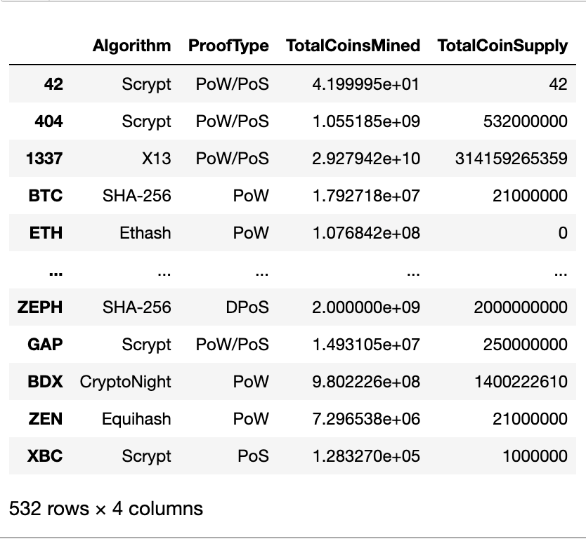
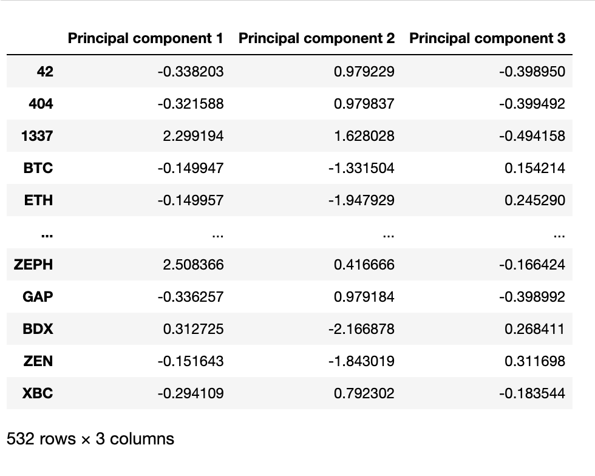
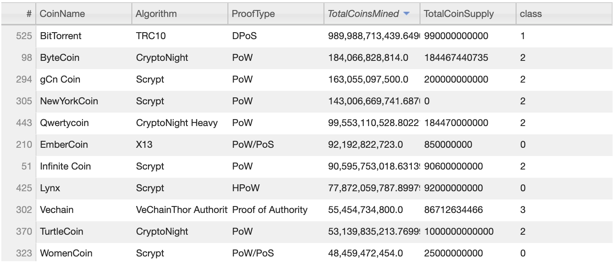
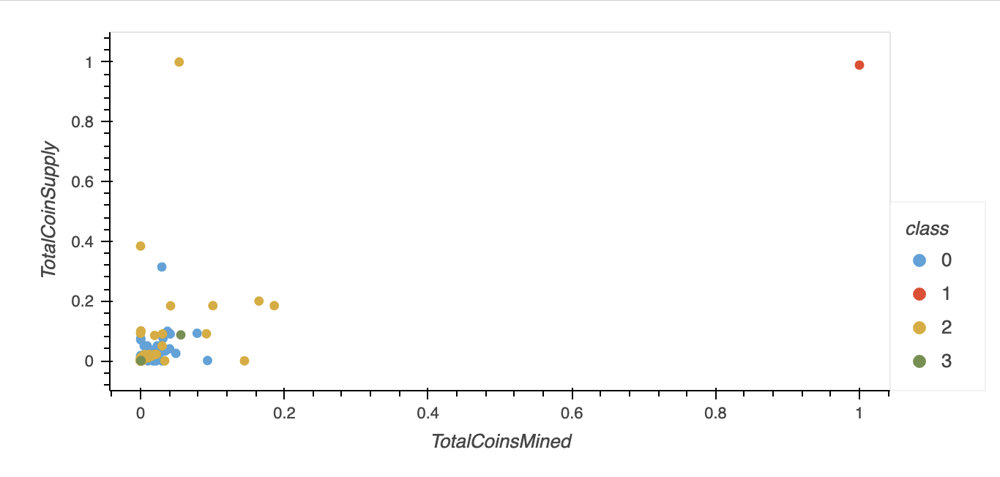
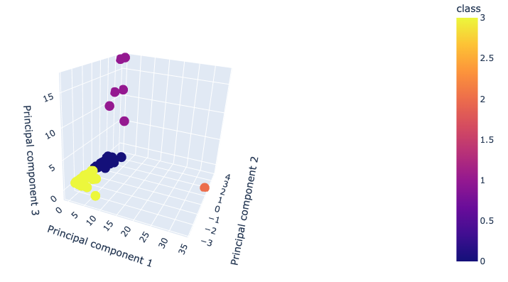

# Cryptocurrencies

## Ovweview
Accountability Accounting, a prominent investment bank, is interested in offering a new cryptocurrency investment portfolio for its customers. The company, however, is lost in the vast universe of cryptocurrencies. In this project, we are going to create a report that includes what cryptocurrencies are on the trading market and how they could be grouped to create a classification system for this new investment. We first process the data to fit the machine learning models. Then we use unsupervised learning to group the cryptocurrencies by clustering algorithm. Fianlly, data will be visualized to share.

## Results
 After data preprocessing, we obtained a clean cryptocurrencies dataset, and used get_dummies() method to make the dataset workable in mechine learning models. 
 

 Then we made a Principal Component Analysis to reduce data dimensions to three.
 

Next, we clustered Cryptocurrencies by using K-means.
 

 Fianlly, visulization of datas in two dimensions and three dimensions respectively.
  

  