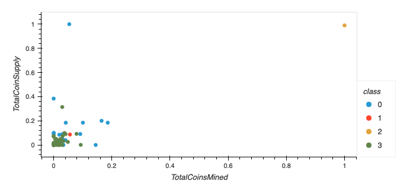
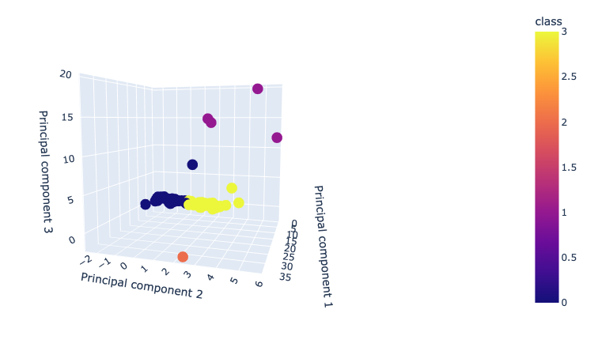

# Cryptocurrencies

## Ovweview
Accountability Accounting, a prominent investment bank, is interested in offering a new cryptocurrency investment portfolio for its customers. The company, however, is lost in the vast universe of cryptocurrencies. In this project, we are going to create a report that includes what cryptocurrencies are on the trading market and how they could be grouped to create a classification system for this new investment. We first process the data to fit the machine learning models. Then we use unsupervised learning to group the cryptocurrencies by clustering algorithm. Fianlly, data will be visualized to share.

## Results
 After data preprocessing, we obtained a clean cryptocurrencies dataset, and used get_dummies() method to make the dataset workable in mechine learning models. 
 

 Then we made a Principal Component Analysis to reduce data dimensions to three.
 

Next, we clustered Cryptocurrencies by using K-means.
 

 Fianlly, visulization of datas in two dimensions and three dimensions respectively.

  

  

From these charts, we found that most of the cryptocurrencies was grouped in class 0 and 3, while class 1 and 2 are minorities. Since we don't have any preditable target in the data set, so we can make a simple conclusion on which cryptocurrencies are worth to invest, but we can induce that if people like any cryptocurrency in class 0 will probably like others in the same class as well. 

Besides, we are interested in what kind of cryptocurrencie in class 1 and 2 since they look special. We generated a table to show the distribution as below. It shows that there are four cryptocurrencie (Vechain, LitecoinCash, Acute Angle Cloud, and Waves)in class 1 and one cryptocurrency (BitTorrent) in class 2. 

 

## Summary
We note that the explained variance is only around 7% for this model, means only 7% of the data in the dataset was reflected in this n=3 component PCA model. 7% is not a good number and it might be because we just have 2 columns of numerical data, which are TotalCoinMined and TotalCoinSupply, the others are all string, thus we don't have much worakble data to fit into the model. Second reason might be because TotalCoinMined and TotalCoinSupply are not a good determinaion factor in this model. However, when we do visulization, we can only visulize it in 3 dimensions, so we need to accpte the truth that the chart we got which contains only 7% of the data. To better clustering the data, we can try to increase the n component number to 5, see whether we can have a larger exaplined variance ratio.
